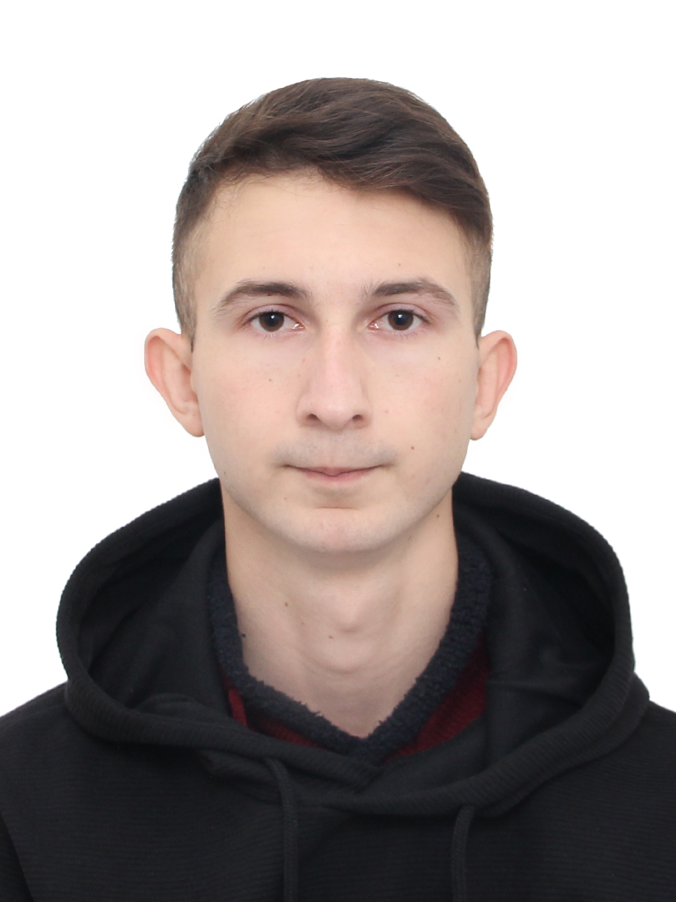

# Korotkevich Ruslan

> Education

* 2004-2015 state educational institution
"Bobovichskaya secondary school"

> ADDITIONAL EDUCATION

* 2021 Basic software testing courses
[сertificate](https://drive.google.com/file/d/1pt_mkP4jgGbZgPGtPMhrmav5Rw9m87gZ/view?usp=sharing)

> WORK EXPERIENCE

* Participation in educational projects on
courses, tested web services as a Qa
engineer (manual)

> SKILLS

* Regression testing, manual testing, web
testing, functional testing, SQL (basic),
Jira, Test case, Git, HTML(basic)

> ABOUT MYSELF

* Perseverance, attention to detail,
completed the specialty Qa engineer
for two months. I have the skill of self-development, easily trained. The topic
of testing is interesting, I am ready to
continue in this direction.

#### CONTACTS:
* Email address: korotkevich_rus@mail.ru
